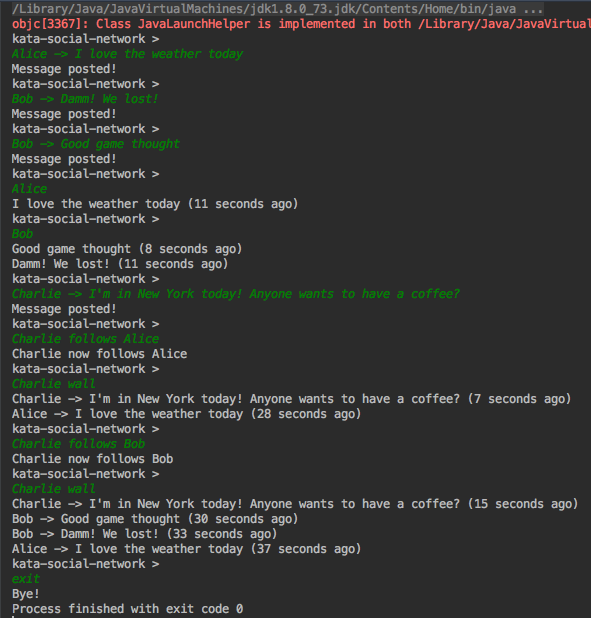

# kata-social-networking

This is a kata extracted from the [Sandro Mancuso](https://twitter.com/sandromancuso) personal repository: https://github.com/sandromancuso/social_networking_kata

I found the exercise interesting and this is my implementation in Java. 

To run the build with test coverage:

    mvn clean jacoco:prepare-agent install jacoco:report
    
You will find the coverage report on /target/site/jacoco/index.html

You can run the TwitterApp class on your IDE or by console:

    mvn clean install
    java -jar target/kata-social-networking-1.0.jar
    
You can run the following scenarios with the expected results:

On this post I explain the whole story of this exercise:

http://www.joantolos.com/blog/kataTwitter

These are the original instructions for the kata:

Social Networking Kata
----------------------

Implement a console-based social networking application (similar to Twitter) satisfying the scenarios below.

### Scenarios

**Posting**: Alice can publish messages to a personal timeline

> \> Alice -> I love the weather today    
> \> Bob -> Damn! We lost!     
> \> Bob -> Good game though.    

**Reading**: Bob can view Alice’s timeline

> \> Alice    
> \> I love the weather today (5 minutes ago)    
> \> Bob    
> \> Good game though. (1 minute ago)     
> \> Damn! We lost! (2 minutes ago)    

**Following**: Charlie can subscribe to Alice’s and Bob’s timelines, and view an aggregated list of all subscriptions

> \> Charlie -> I'm in New York today! Anyone wants to have a coffee?     
> \> Charlie follows Alice    
> \> Charlie wall    
> \> Charlie - I'm in New York today! Anyone wants to have a coffee? (2 seconds ago)    
> \> Alice - I love the weather today (5 minutes ago)    

> \> Charlie follows Bob    
> \> Charlie wall    
> \> Charlie - I'm in New York today! Anyone wants to have a coffee? (15 seconds ago)     
> \> Bob - Good game though. (1 minute ago)     
> \> Bob - Damn! We lost! (2 minutes ago)     
> \> Alice - I love the weather today (5 minutes ago)    

### General requirements 

- Application must use the console for input and output; 
- User submits commands to the application: 
    - posting: \<user name> -> \<message> 
    - reading: \<user name> 
    - following: \<user name> follows \<another user> 
    - wall: \<user name> wall 
- Don't worry about handling any exceptions or invalid commands. Assume that the user will always type the correct commands. Just focus on the sunny day scenarios.
- Use whatever language and frameworks you want. (provide instructions on how to run the application)
- **NOTE:** "posting:", "reading:", "following:" and "wall:" are not part of the command. All commands start with the user name.